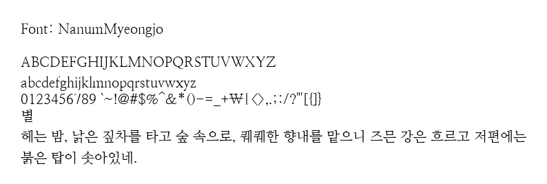

# pangram-font-renderer


주어진 TTF 파일을 자동으로 불러와 팬그램(예: "The quick brown fox jumps over the lazy dog") 내용을 이미지로 저장하는 프로그램

# 사용법

## 폰트 파일 준비

다양한 폰트 파일(ttf 확장자)를 `data/fonts`폴더에 넣습니다.

## Docker 이미지 빌드 및 실행

프로젝트 디렉토리로 이동합니다. Docker 이미지 빌드:

```bash
docker build -t font-renderer .
```

- `font-renderer`라는 이름의 Docker 이미지를 생성합니다.


Docker 컨테이너 실행:

```bash
docker run -it -v $(pwd):/app -u "$(id -u):$(id -g)" font-renderer
```

### 원하는 문구와 글씨 크기 조절

```bash
docker run -it -v $(pwd):/app -u "$(id -u):$(id -g)" font-renderer --text "HELLO" --font_size 40
```

## 결과 확인

실행이 완료되면 `data/output` 디렉토리에 아래와 같은 여러 이미지 파일이 생성되어 있을 것입니다.



